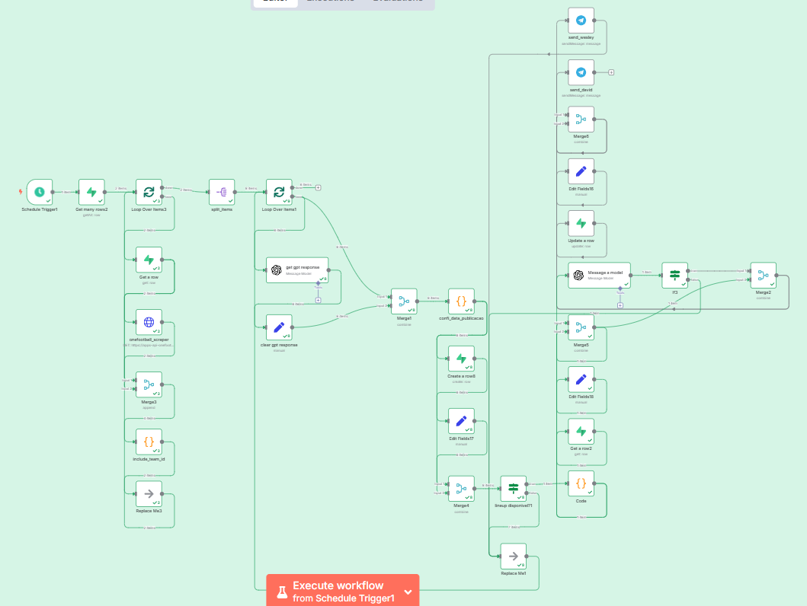
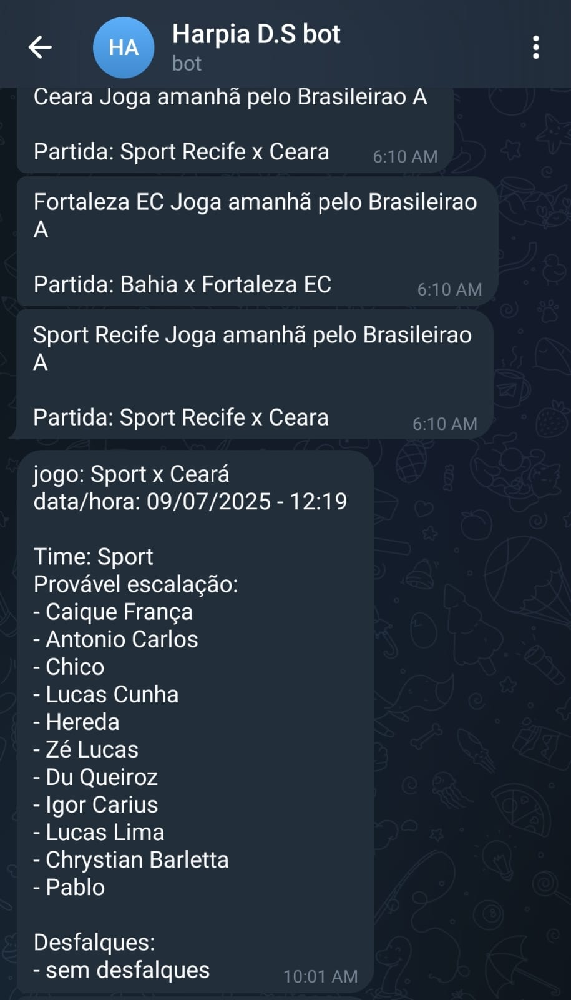

# Webscraping de Escalações: API Football + OneFootball + Telegram

## 🎯 Objetivo
Automatizar a coleta de notícias sobre escalações de futebol, interpretar os textos utilizando IA e distribuir as informações em grupos de Telegram.

## 🖼️ Exemplo de fluxo automatizado no n8n

## 🤖 Bot enviando escalação no Telegram

## 🧰 Tecnologias utilizadas
- Python
- FastAPI
- Supabase
- n8n
- Evolution API
- OneFootball (scraping)
- Telegram Bot
- Docker
- VM Contabo

## 🚀 Destaques do projeto
- Scraping escalonado por blocos de times
- Deduplicação inteligente via Supabase
- Processamento de linguagem natural com IA para extrair escalações
- Integração direta com Telegram
- API exclusiva para scraping

## ☁️ Infraestrutura
O projeto está hospedado na infraestrutura da Harpia D.S., com suporte completo ao cliente.

> Por questões contratuais e de confidencialidade, o código-fonte não está disponível publicamente.
